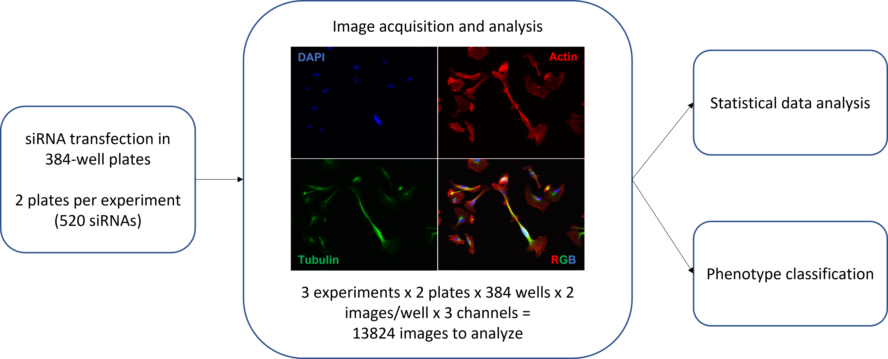

# TFM MADOBIS - An image analysis pipeline for detecting different cell phenotypes in breast cancer cells 🔬💻
This is the readme file that contains the information about the code and data used in the TFM that are available in this repository.

The processing pipeline developed in CellProfiler for this project is available in cppipe format. This pipeline has been used to generate the output data used in the analysis from image raw data.

The code and data corresponding to gene network analysis are available in the folder "gene_network_analysis".

The code and a sample of per_image and per_object data due to the large size of the files are available in the folder "image_data_analysis". Complete raw data can be accessed upon request to the authors.

The code and data corresponding to the analysis of the classifier results are available in the folder "classifier_results_analysis". In this folder is also provided the file with the Random Forest algorithm used to classify the phenotype of cells with long projections.

## Description of the project

Cell shape provides valuable information about the cellular phenotype and the cell’s physiological state due to the connection between morphology and phenotype. Thus, morphological analysis could allow us to understand relevant underlying mechanisms in diseases with an important morphological component such as cancer, particularly in the metastatic process.

Furthermore, advances in automated microscopy have made it possible to develop image-based high-throughput cell profiling assays, that allow to define complex cellular phenotypes through the extraction of multiple features for each cell of the population. Thus, with this approach, we can generate large quantities of data at population resolution and at single-cell resolution to identify genes involved in different biological processes and heterogeneous cell behaviors.

Based on the importance of cell shape dynamics on metastasis, we used a small interfering RNA library to specifically suppress the expression of more than 500 proteins related to the cytoskeleton on a metastatic cell line of triple-negative breast cancer to perform a cell profiling approach.

The large amount of image data composed of fluorescence images of cells with silenced expression of each of the genes was processed using CellProfiler software, for which we developed a processing pipeline that automatically extracts hundreds of cell features from thousands of images.

In this work we employed a mixed approach for the analysis of data. On the one hand, a set of interpretable features related to cell morphology allowed the identification of new potential targets or effectors in cancer cells through the appearance of discordant phenotypes with the rest of the population. On the other hand, machine learning algorithms capable of dealing with high dimensional and complex data allowed the identification of possible related genes based on concordant phenotypes in loss of function conditions. 
                                                                                                                                
## Contact

ferrodbej@alum.us.es
